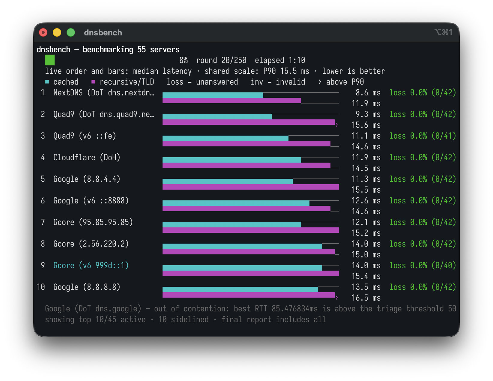

# dnsbench

dnsbench is a command-line tool that benchmarks and diagnoses recursive DNS servers **as seen from your own network**. It measures cached, uncached and recursive-path latency, packet loss, retries and stability, and it characterizes each server's behavior: DNSSEC validation, NXDOMAIN handling, DNS rebinding protection and optional modern extensions (DNS64, QNAME minimization, HTTPS records). It ranks every enabled category with equal weight by default, compares aggregate latency costs with a paired bootstrap and explains the results in plain language.

Every number produced by dnsbench is specific to one network, one ISP, one location and one time of day. A server that wins here can lose on another network or at another hour, so treat the ranking as a local snapshot, not a universal truth.

**Who it is for:** anyone choosing a DNS resolver for a home or office network, network administrators comparing resolvers from a specific vantage point, and curious users who want to understand what their current resolver actually does.



## Install

Download one file, unpack it, run it. There is nothing to install, no runtime to
set up, no account to create, and no administrator rights are needed — dnsbench
is a single self-contained executable that only sends DNS queries. Grab the
latest build from the [releases page](https://github.com/ialexsilva/dnsbench-cli/releases/latest)
or use the commands below.

### macOS

Apple Silicon (M1 and later) and Intel Macs need different files. If you are not
sure which you have, run `uname -m`: `arm64` means Apple Silicon, `x86_64` means
Intel.

```sh
# Apple Silicon
curl -fsSL https://github.com/ialexsilva/dnsbench-cli/releases/latest/download/dnsbench-darwin-arm64.tar.gz | tar -xz

# Intel
curl -fsSL https://github.com/ialexsilva/dnsbench-cli/releases/latest/download/dnsbench-darwin-amd64.tar.gz | tar -xz

./dnsbench run
```

**If you downloaded the archive with your browser instead**, macOS will refuse to
run the binary and report that it "cannot verify dnsbench is free of malware".
That happens because browsers attach a quarantine flag to downloads and these
release builds are not notarized with an Apple Developer ID. Clear the flag once
and it runs normally:

```sh
xattr -dr com.apple.quarantine dnsbench
```

Files fetched with `curl`, as above, are never quarantined, so that step is only
needed for browser downloads. The message is expected for any un-notarized
command-line tool and says nothing about this one in particular.

### Linux (x86-64)

```sh
curl -fsSL https://github.com/ialexsilva/dnsbench-cli/releases/latest/download/dnsbench-linux-amd64.tar.gz | tar -xz
./dnsbench run
```

There is no prebuilt ARM64 Linux binary yet, so on a Raspberry Pi or an ARM
server you need to [build from source](#build-from-source).

### Windows

In PowerShell:

```powershell
Invoke-WebRequest -Uri https://github.com/ialexsilva/dnsbench-cli/releases/latest/download/dnsbench-windows-amd64.zip -OutFile dnsbench.zip
Expand-Archive dnsbench.zip -DestinationPath .
.\dnsbench.exe run
```

### Optional: run it from anywhere

The steps above leave the executable in the current folder, which is enough for a
one-off benchmark. To call `dnsbench` from any directory, move it onto your
`PATH`:

```sh
sudo mv dnsbench /usr/local/bin/     # macOS and Linux
```

Check that it worked with `dnsbench --version`.

## Quick start

The examples below assume the executable is in the current folder. If you moved
it onto your `PATH`, drop the `./` prefix; on Windows use `.\dnsbench.exe`.

```sh
# Learn what the tool measures and how to read the results
./dnsbench intro

# Show the DNS servers configured on this system
./dnsbench discover

# Full benchmark with defaults: system + built-in + user servers,
# standard mode (250 rounds), cached and recursive/TLD categories,
# persistent sessions and equal category weights
./dnsbench run

# Quick benchmark of the built-in public resolvers, IPv4 only
./dnsbench run --mode quick --builtin --no-ipv6

# Benchmark two specific servers, show the detailed table and export reports
./dnsbench run --only 1.1.1.1,9.9.9.9 --details --export json,txt --out reports

# Benchmark and open a shareable HTML report in the browser when the run finishes
./dnsbench run --builtin --open

# Characterize servers (DNSSEC, NXDOMAIN, rebinding) without benchmarking
./dnsbench probe --builtin --verbose

# Enable the uncached category with a zone you control
./dnsbench run --uncached-zone bench.example.com
```

A default `run` takes several minutes: it is 250 measured rounds against every
selected resolver, deliberately paced so the benchmark does not congest your own
network. Use `--mode quick` for a faster, rougher answer.

Keep the network idle during a run: downloads, streaming and calls distort the numbers.

## Commands

| Command | Description |
| --- | --- |
| `dnsbench intro` | Learn what dnsbench measures and how to read the results |
| `dnsbench discover` | Show the DNS servers configured on this system |
| `dnsbench servers list` | List all known DNS servers (system + user + built-in) |
| `dnsbench servers add` | Add a DNS server to the user list |
| `dnsbench servers import` | Import DNS servers from a file into the user list |
| `dnsbench servers export` | Export the known DNS servers to a file |
| `dnsbench probe` | Characterize DNS servers without benchmarking them |
| `dnsbench run` | Run the full DNS benchmark and print a ranked report |
| `dnsbench completion` | Generate shell autocompletion scripts |

Global flags: `--no-color` disables colored output; `-v, --version` prints the version. Run `dnsbench <command> --help` for the full flag list of each command.

The built-in list ships 55 public resolver endpoints (UDP, DoT and DoH) from operators including Google Public DNS, Cloudflare, Quad9, OpenDNS, AdGuard DNS, CleanBrowsing, Control D, DigiCert UltraDNS, Gcore Public DNS, NextDNS and Comodo Secure DNS. The user list is stored as `servers.json` under your OS user config directory (for example `~/Library/Application Support/dnsbench` on macOS, `~/.config/dnsbench` on Linux, `%AppData%\dnsbench` on Windows).

The popular domains used by the cached benchmark are stored in [`internal/model/cached_domains.json`](internal/model/cached_domains.json). Edit the `domains` array to review, add or remove entries, then rebuild `dnsbench`; the JSON is validated and embedded into the executable at compile time.

## Reports and exports

The terminal prints a compact report: a one-line run summary, a single ranking (bar · latency cost · loss, with your current DNS marked and statistical ties flagged) and a footer. Lower latency cost is better. A `*` after the cost means penalties are part of it, so the number sits above the measured latency — the HTML report breaks down which penalties and by how much. `--details` adds the per-category metrics table.

For a full, shareable report use `--export html`, or `--open`, which writes the HTML report and opens it in your browser when the run finishes. The file is self-contained — verdict, full ranking, an embedded chart, latency-cost breakdown, server characteristics, detailed metrics and the factual DNS-configuration and comparison sections — so it needs no network and adapts to light or dark themes. Available formats are `json`, `csv`, `txt` and `html`; `--out` sets the directory, `--prefix` the file name, and `--include-raw` keeps per-query samples in the JSON. The CSV has one row per server and category, and closes each row with the selected ranking's `ranking_mode`, `rank`, `cost_base_ms`, `cost_penalty_ms` and `latency_cost_ms` so the ranking can be reproduced in a spreadsheet; servers that never earned a rank leave those cells empty.

## Measurement pacing

dnsbench spaces its query launches with a single global pacer (`--pace`, default 20ms) and reuses one connected socket per server, so a run does not flood the local Wi-Fi link, NAT router or uplink and then misread the resulting drops as server loss. `--pace` is where the run starts, not a bound: the pace adapts in both directions as the run progresses, shortening on clean networks to as little as a quarter of it and, when timeouts appear across several servers at once (the signature of local congestion rather than of any one server), easing off to as much as 8× it and noting the adjustment in the live view. See [docs/METHODOLOGY.md](docs/METHODOLOGY.md) for details.

While a run is in progress dnsbench also asks the operating system not to enter idle sleep, so leaving the machine unattended (or letting the display turn off) does not suspend the process mid-run and poison the timings. It uses the native mechanism of each platform — `caffeinate` on macOS, a systemd-logind idle inhibitor lock held over D-Bus on Linux, and `SetThreadExecutionState` on Windows.

The request is deliberately narrow and identical on every platform: it suppresses *automatic* idle sleep only. The display still turns off as usual, and an explicit suspend — closing the lid, `systemctl suspend`, Sleep from the menu — is never blocked. The inhibition is released when the run finishes, and also if dnsbench is interrupted or killed, so nothing is left holding the machine awake. Pass `--no-keep-awake` to disable it. Where no mechanism is available (or the request fails) the run continues normally and prints a notice.

## Supported platforms and DNS discovery

dnsbench runs on macOS, Linux and Windows. System DNS discovery is read-only and works differently on each platform:

- **macOS** — runs `scutil --dns` and parses the resolver list, including the interface each resolver is bound to.
- **Linux** — reads `/etc/resolv.conf`. If it only contains a local stub resolver (`127.0.0.53` / `127.0.0.1`, typical with systemd-resolved), dnsbench additionally runs `resolvectl status` to discover the real upstream servers, and warns if it cannot.
- **Windows** — runs `netsh interface ipv4 show dnsservers` and `netsh interface ipv6 show dnsservers` and parses both.

Discovered addresses are de-duplicated and tagged with their interface and role. Discovery always runs so selected built-in or user endpoints can still be marked as the current DNS even when `--builtin` or `--user` controls which sources enter the benchmark. When a system resolver is a local/private address (loopback, RFC 1918, link-local, IPv6 ULA or CGNAT), dnsbench labels that endpoint as a local DNS forwarder. This does not mean discovery failed: only the upstream hidden behind that specific local endpoint may be unknown, while other system DNS addresses are detected and listed separately.

## Privacy

- **100% local execution.** All measurement, statistics and report generation happen on your machine.
- **No telemetry.** Nothing leaves the machine except the DNS test queries themselves.
- **Never changes your system DNS configuration.** Discovery and benchmarking are read-only; dnsbench never reconfigures the resolver.
- Exports are written only to the local directory you choose, and raw per-query samples are included only when you pass `--include-raw`.

## Methodological caveats

These constraints remain documented for interpreting the measurements, but the CLI report does not turn them into a final recommendation:

1. Results are valid for the network and time of the test.
2. Congestion can change the ranking.
3. Unstable Wi-Fi can produce false loss.
4. A local router can hide the real upstream DNS.
5. Lower DNS latency does not guarantee faster full page loads.
6. CDN geolocation can vary by resolver.
7. EDNS Client Subnet can influence responses of geo-distributed services.
8. Malware, ad or content filtering can deliberately modify responses.
9. DoH and DoT protect transport to the resolver but do not by themselves prove the operator's privacy policy.

## Build from source

Only needed to contribute, to target a platform without a prebuilt binary, or to
change the embedded domain list. Everyone else should use the
[install instructions](#install) instead.

Requirements: Go 1.26 or newer (see `go.mod`). There are no other dependencies —
no external services, no accounts.

```sh
make build
```

That produces a binary under `releases/<goos>/<goarch>/`, for example
`releases/darwin/arm64/dnsbench`. Cross-compilation uses the same command with
explicit target values, and Windows builds get the `.exe` extension
automatically:

```sh
make build GOOS=linux GOARCH=arm64
```

To run without building a binary:

```sh
go run ./cmd/dnsbench --help
```

On macOS the Makefile ad-hoc signs the result, and a locally built file is never
quarantined, so it runs without the Gatekeeper prompt that a browser-downloaded
release archive triggers.

## Documentation

- [docs/ARCHITECTURE.md](docs/ARCHITECTURE.md) — package map, data model, full benchmark flow, concurrency strategy, error taxonomy
- [docs/METHODOLOGY.md](docs/METHODOLOGY.md) — what is measured and why: query categories, warmup, triage, DNSSEC, NXDOMAIN, rebinding, statistical significance
- [docs/FORMULAS.md](docs/FORMULAS.md) — every formula with worked numeric examples, plus the complete ranking weight tables

## License

dnsbench is open-source software licensed under the
[Apache License 2.0](LICENSE). You may use, modify and redistribute it,
including commercially, provided that you comply with the license terms and
preserve the attribution notices from [NOTICE](NOTICE) in redistributions and
derivative works.
